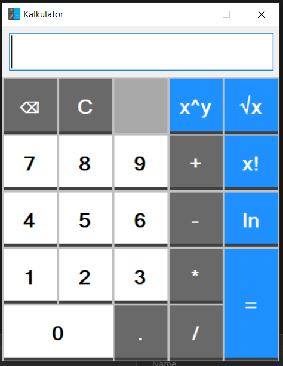

    <h1>Kalkulator</h1>
    
VUT FIT IVS Projekt 2

    

    
     
    

# IVS Projekt 2
Druhý projekt k predmetu Praktické aspekty vývoja software: Jednoduchá kalkulačka s GUI, manuálom, dokumentáciou, inštalátorom a vlastnou matematickou knižnicou. 

## Viac o projekte
Projekt je určený za účelom tímovej spolupráce, implementácie jednoduchého programu a celkového vytvárania software - plánovanie, programovanie, testovanie, ...

## Zadanie projektu
Celkové zadanie projektu: http://ivs.fit.vutbr.cz/projekt-2_tymova_spoluprace2019-20.html

## Názov tímu:
* **Slovenská (j)elita**

## Členovia tímu:
* **Tomáš Zaťko (xzatko02)**
* **Martin Rakús (xrakus04)**
* **Patrik Jacola (xjacol00)**
* **Monika Kubincová (xkubin24)**
